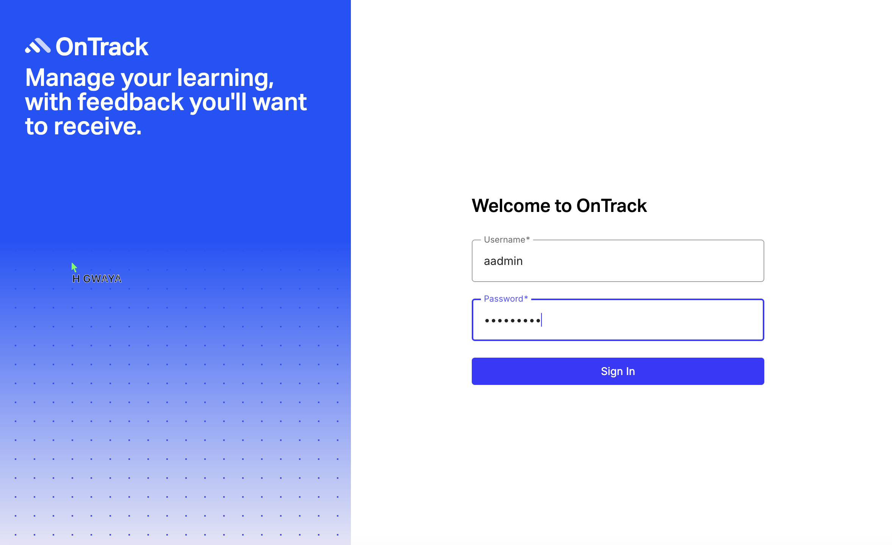
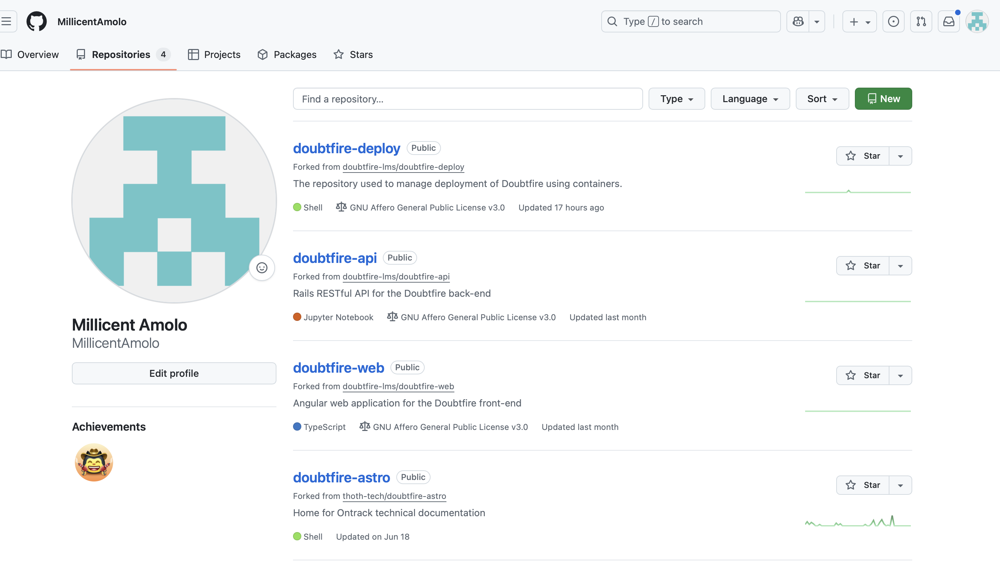
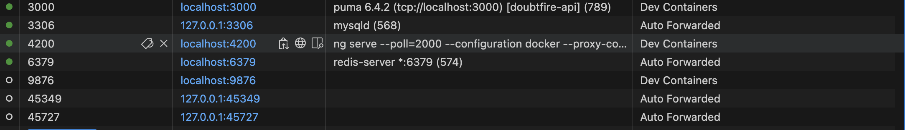

# Admin Access Control Implementation

## Overview
This documentation explains the implementation of admin access restrictions in the frontend of the OnTrack system under the Capstone project with Thoth Tech.

## Technologies Used
- Angular (routing and guards)
- Visual Studio Code
- Git (feature/admin-access-control branch)
- Astro Framework (for documentation)
- Node.js + Dev Containers

## Key Actions
- Set up dev environment and confirmed running ports (4200 for frontend).
- Implemented route guards to restrict `/admin/units` from student access.
- Redirected unauthorized users to a dashboard or error page.
- Used a dedicated Git branch to manage changes safely.
---

## Testing Methodology

### Manual Testing Approach

The admin access control functionality was manually tested in a local development container using the Angular app served at `localhost:4200`.

- **Step 1:** Log in with a **student/non-admin account**.
- **Step 2:** Attempt to visit the admin route: `/#/admin/units`.
- **Expected Result:** The student should be redirected to a non-admin page (dashboard or error).
- **Actual Result:** The user was redirected and shown a page with the message:
  > “You are not enrolled in any OnTrack units.”

✅ This confirms that unauthorized users are blocked from admin content.

### Screenshot (Test Output)

---

## Conclusion

This test confirms that the admin route protection is working as intended. Future improvements may include automated testing using Angular's testing tools or Cypress.

## Screenshots
- Unauthorized access test:
  

- Repo forked view:
  

- Ports in dev container:
  

## Notes
This restriction improves user experience and protects sensitive admin features from misuse.
